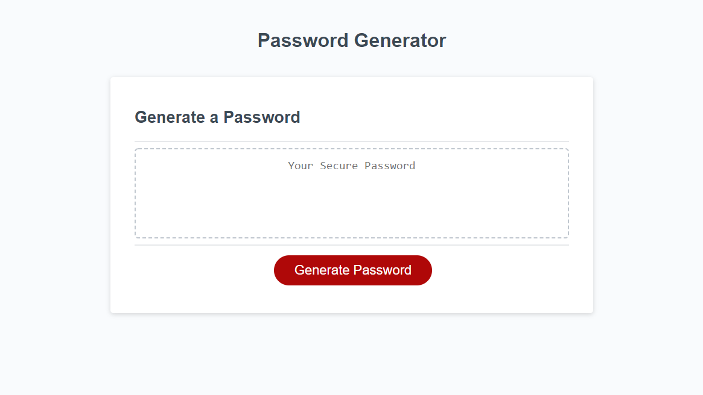

# My Portfolio Website

## Table of Contents
The following readme contains these sections:

* [Screenshot](#Screenshot)
* [Usage](#Usage)
* [Live-Link](#Live-Link)
* [License](#License)

## Screenshot

## Usage

[This password generator](https://joey-sisk.github.io/PasswordGenerator/) is designed to accept user input regarding password length, and what character types the user wants to include. The user is required to keep the password over 8 and under 128 characters and if they either enter a number outside of those bounds or enters a non number input they will be prompted to try again. If they enter a number with a decimel point it will be rounded down. The password will choose from a pool of characters selected by the user and randomly deliver a password for them to use. 

## Live-Link

[You can find a link to the live site here.](https://joey-sisk.github.io/PasswordGenerator/)

## License

There is not currently a license for this service as it is only a homework assignment for the UT Coding Bootcamp Class 2020-2021
